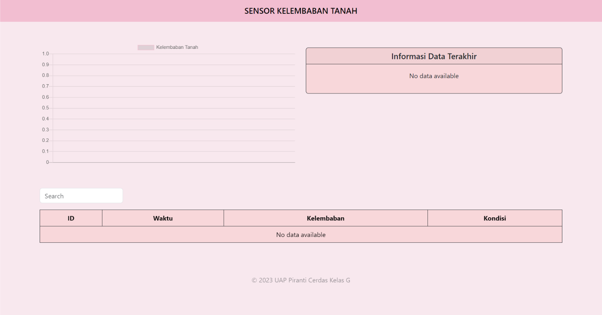

# Automatic Irrigation System
Automatic Irrigation System is a project that utilizes resistive soil moisture sensors to automatically control plant watering. This system is designed to detect the soil moisture level and automatically activate or deactivate the irrigation pump according to the plant's needs

## Components
* ESP 32
* Resistive Soil Moisture Sensor
* 12V Adaptor
* Jack DC Female
* DC Water Pump 12V
* Selang
* Module Relay
* Breadboard
* Kabel Jumper
* Kabel listrik

## Display

[PPT](https://docs.google.com/presentation/d/1FEWCX5VWh3USXU9SrFf0DkupoPaOWDH2M6gjNx1o2Kg)

## Members
- 202110370311462 - [Bahrul Ulum Fadhlur Rohman](https://github.com/ulumfr)
- 202110370311481 - [Muhammad Gus Nadir](https://github.com/mgusnadir)
